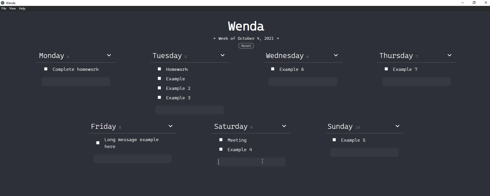

# Wenda

Wenda is a completely offline-based productivity manager desktop application capable of tracking the users weekly agenda, todos, and important dates. Tasks are stored persistently in JSON files locally. Written in TypeScript with ElectronJS and ReactJS.

## Showcase

## Usage

Release is a WIP!

## Acknowledgements

Boilerplate Code: [Electron-React-Boilerplate](https://github.com/electron-react-boilerplate/electron-react-boilerplate)
